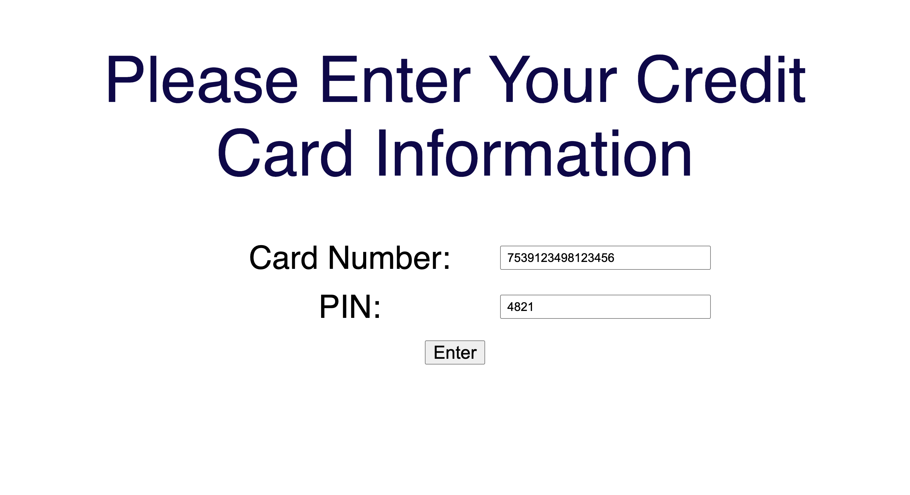
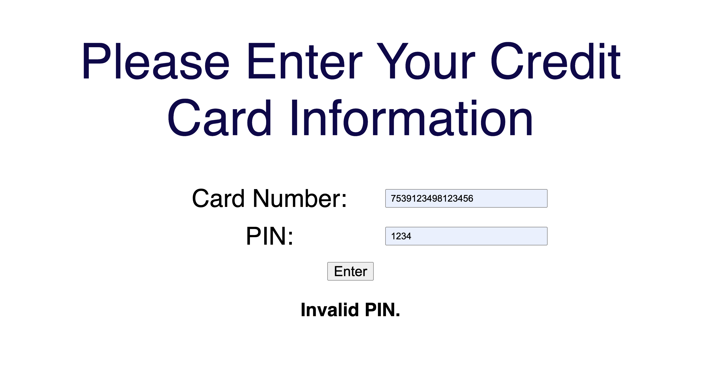
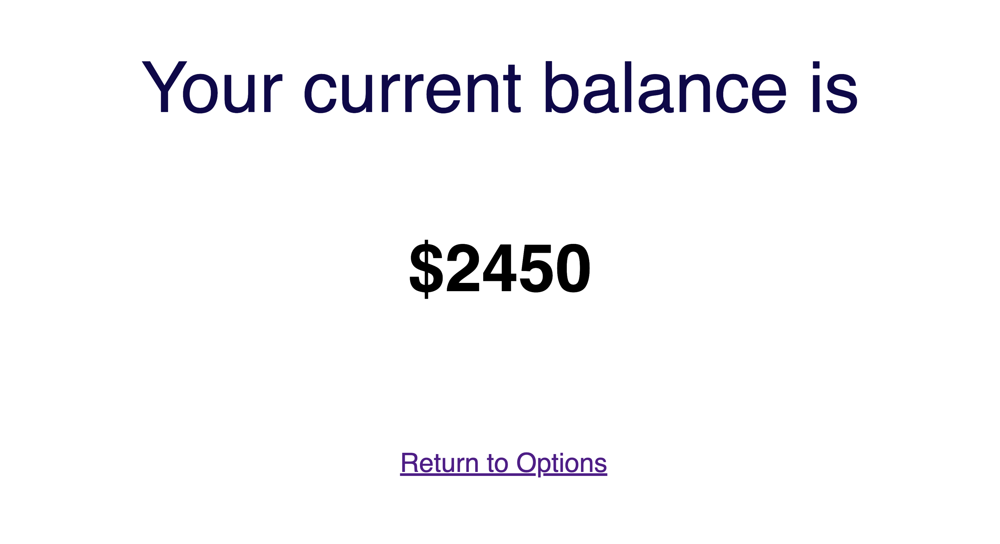
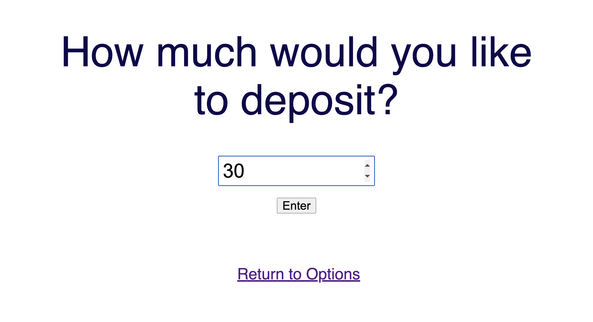
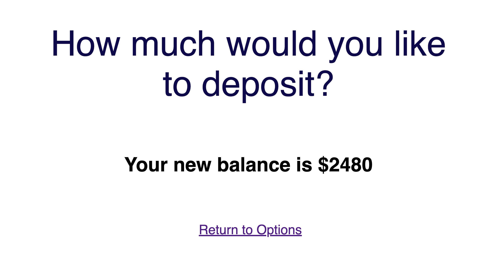
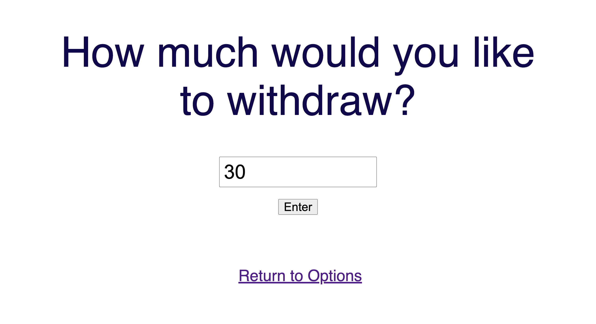
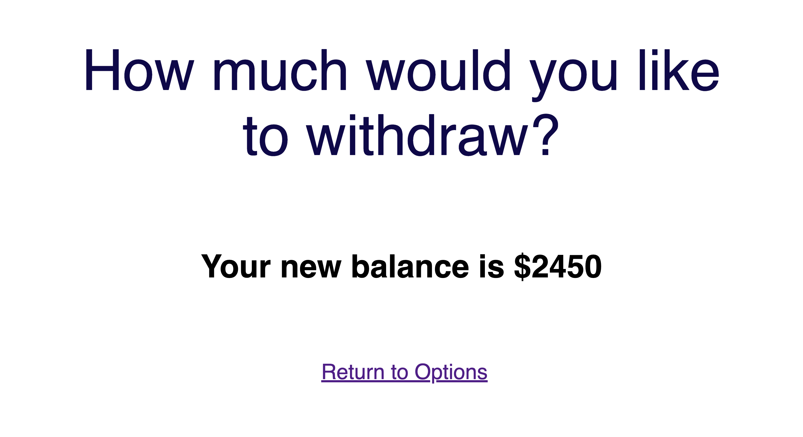
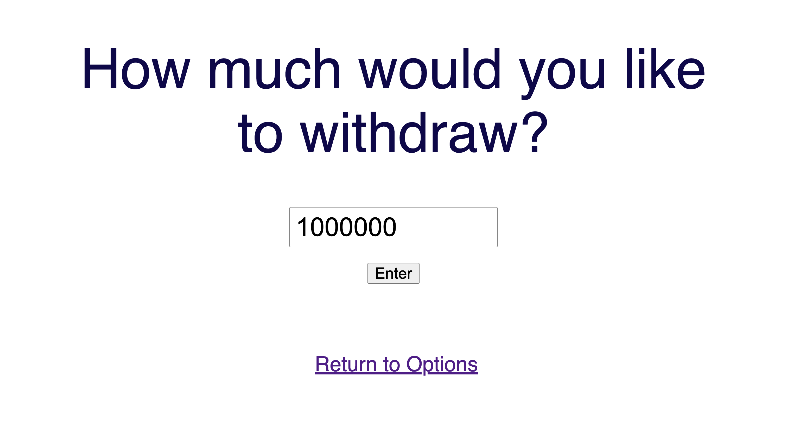

# Simple ATM / Bank API

A simple, secure RESTful API simulating core ATM functionality (authentication, deposit, and withdrawal) built using the **JavaScript, Node.js, Express, and MySQL** stack.

---

## Prerequisites

You need to have the following packages installed before you begin.

* **Node.js & npm** (Node Package Manager)
* **MySQL Server** (Installed via Homebrew, Docker, or preferred method)

---

## Getting Started

### 1. Clone the Repository & Install Dependencies

Clone the project repository and navigate into the directory. Then, install all necessary Node.js dependencies:

```bash
git clone https://github.com/yunhajo/simple_ATM
cd simple_ATM

# Install core dependencies: Server, Security, Database, and Environment management
npm install express multer bcrypt mysql2 cookie-parser
```

### 2. Database Setup (MySQL)

You must initialize the database and set up permissions before starting the application.

#### A. Connect to MySQL

Connect to your MySQL server as the root user:

```bash
mysql --local-infile=1 -u root -p
```

#### B. Database Setup

Source necessary files for database setup:

```bash
# 1. Database creation and context setting
mysql> source start.sql;

# 2. Table creation (e.g., 'accounts', 'transactions')
mysql> source setup.sql;

# 3. Inserting initial account data (with hashed PINs)
mysql> source load-data.sql;

# 4. Creating the application user ('appadmin') and granting permissions
mysql> source grant-permissions.sql;
```

### 3. Running the Application

Start the Node.js server using your entry file.

```bash
node node-mysql.js
```

The application will start, typically listening on port 8000.

```bash
Listening on port 8000...
```

### 5. Example Test Cases

Use the following card numbers and corresponding PINs to test the transactions (deposits, withdrawals, and balance checks). Note that the PINs in the database will be stored as secure hashes.

| Customer Name | Card Number | PIN |
| :--- | :--- | :--- |
| S K | 7539123498123456 | 4821 |
| J P | 4920183492341290 | 9304 |
| M C | 1719238471239845 | 1189 |
| H L | 4539129934128876 | 5502 |

### 6. Example Runthrough

#### 1. Home Page
The front page of ATM website looks like the follwing. 



Once you enter credit card information and PIN number, you move to options page.

Invalid credentials will result in an error.



#### 2. Options Page


Currently, the website supports three different functionalities: checking balance,
depositing into account, withdrawing from the acoount.

#### 3. Balance

If you click on balance, you can check your account balance.


#### 4. Deposit

If you click on deposit, then you can deposit money into your account.


Here's the screen after successful deposit:


#### 5. Withdrawl
If you click on withdrawl, then you can withdraw money from your account.


Here's the screen after successful deposit:


If you try to withdraw amount greater than your account balance, the ATM will throw an error.
